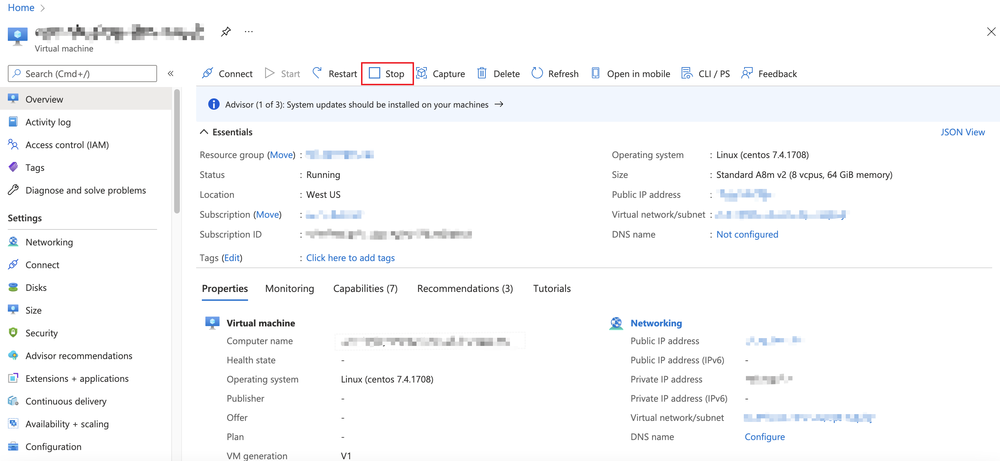
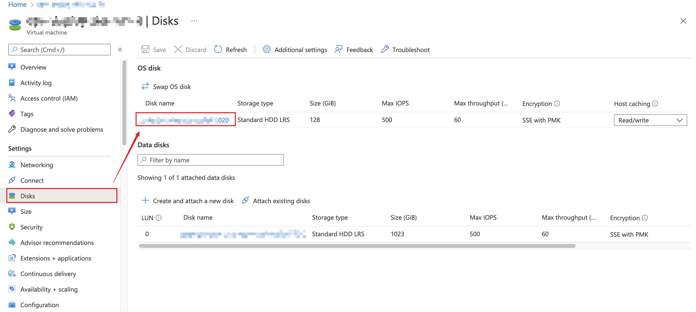
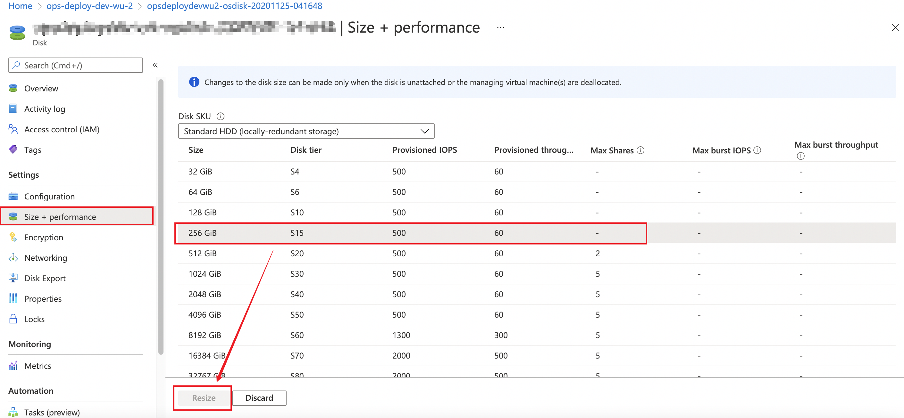

## Resize disk
### Check your filesystem size
```bash
df -hT
Filesystem     Type      Size  Used Avail Use% Mounted on
/dev/sda2      xfs        30G   27G  2.6G  92% /
```
In this case , our target disk is  /dev/sda2
which means: /dev/sda partition: 2

### Check your disk size
```bash
lsblk
NAME   MAJ:MIN RM  SIZE RO TYPE MOUNTPOINT
fd0      2:0    1    4K  0 disk 
sda      8:0    0   30G  0 disk 
├─sda1   8:1    0  500M  0 part /boot
└─sda2   8:2    0 29.5G  0 part /
```

### Stop your vm on azure portal


### Enter disk settings from vm


### Resize your disk size
Because this is the `/root` disk, it could only be resized when the vm is stopped.


### Start your vm on azure portal

## Extend xfs filesystem

### install tools and resize
```bash
yum Install cloud-utils-growpart -y
# extend your disk
growpart /dev/sda 2
# extend your filesystem
xfs_growfs -d /dev/sda2
```

### Check your disk size again
```bash
lsblk
NAME   MAJ:MIN RM   SIZE RO TYPE MOUNTPOINT
fd0      2:0    1     4K  0 disk 
sda      8:0    0   128G  0 disk 
├─sda1   8:1    0   500M  0 part /boot
└─sda2   8:2    0 127.5G  0 part /      # notice the `SIZE` is extended
```

### Check your filesystem again
```bash
df -h
Filesystem      Size  Used Avail Use% Mounted on
/dev/sda2       128G   27G  101G  22% /   # notice the `SIZE` is extended
```
